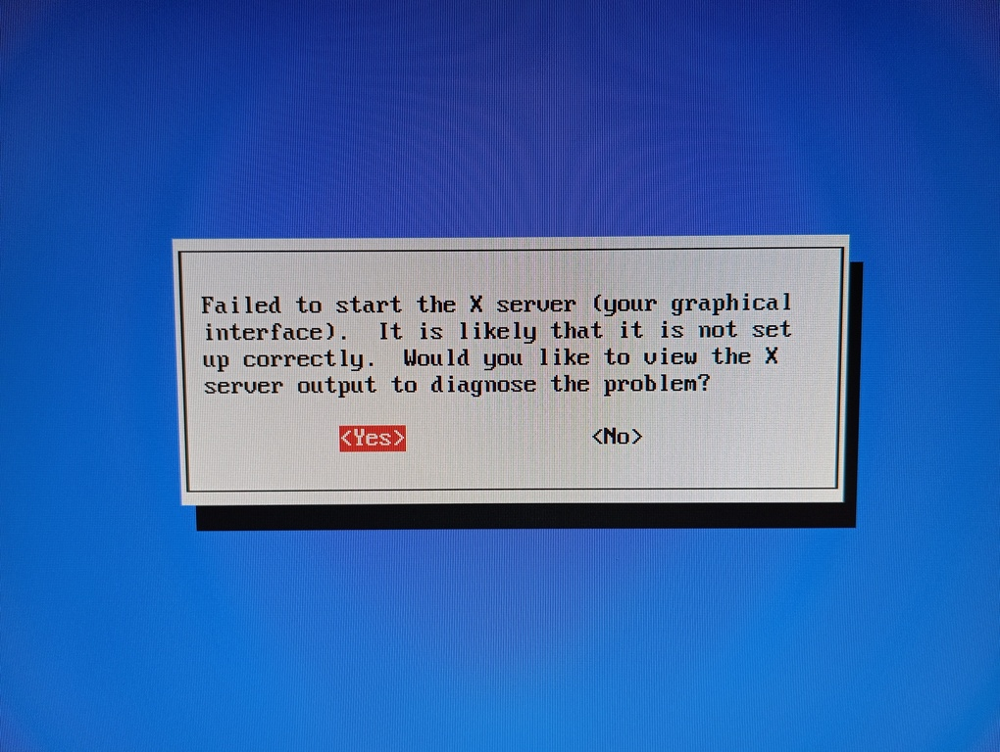

# Installing Debian GNU/Linux on SGI Indy
<br>
<br>
According to my experience, installing Debian GNU/Linux on Indy using netinstall CD or net boot has these issues:<br>
9, 10, ... : for specific motherboards, incompatible with Indy<br>
8: strange chars are shown on boot and freezes https://www.youtube.com/watch?v=pADq72n-V_0<br>
7, 6, 5: error copying kernel to disk: "WARNING: the following packages cannot be authenticated". The package is kernel_version-r4k-ip22<br>
4: installation Ok<br>
<br>
<h3>1. Download the file netboot-boot.img and store it on Reanimator's directory /home/irix/i</h3>
- download link: http://archive.debian.org/debian/dists/etch/main/installer-mips/current/images/r4k-ip22/netboot-boot.img<br>
<br>
<h3>2. Run on Command Monitor:</h3>

```
setenv netaddr 192.168.9.1
bootp():netboot-boot.img
```
** tip **<br>
- define a "debian" variable in Command Monitor:<br>
Indy: <b>setenv -p debian "bootp():netboot-boot.img"</b><br>
This way, you can run $debian in Command Monitor to easily start the Debian installation:<br>

```
setenv netaddr 192.168.9.1
$debian
```
(video) <a href=https://youtu.be/g21rlFwnXjY target="_blank">Indy booting Debian GNU/Linux 4.0 Etch installation</a><br>
<br>
<h3>3. Partitioning the hard disk</h3>
- main reference: https://www.pvv.org/~pladsen/Indy/HOWTO.html<br>
- additional references:<br>
http://www.ingallegri.com/public/debianSgi.html<br>
http://www.wagemakers.be/english/doc/indy<br>
<br>
- My disk:

```
Disk /dev/sda (SGI disk label): 64 heads, 32 sectors, 8678 cylinders
Units = cylinders of 2048 * 512 bytes
```

```
user@indy:~$ sudo hwinfo --disk
01: SCSI 01.0: 10600 Disk                                       
  [Created at block.218]
  Unique ID: 0549.4HNtyCTGo35
  SysFS ID: /block/sda
  SysFS BusID: 0:0:1:0
  SysFS Device Link: /devices/platform/host0/target0:0:1/0:0:1:0
  Hardware Class: disk
  Model: "HP 9.10GB A 68-S94C"
  Vendor: "HP"
  Device: "9.10GB A 68-S94C"
  Revision: "S94C"
  Serial ID: "RE244084"
  Driver: "sd"
  Device File: /dev/sda (/dev/sg0)
  Device Files: /dev/sda, /dev/disk/by-id/scsi-SHP_9.10GB_A_68-S94RE244084
  Device Number: block 8:0-8:15 (char 21:0)
  Geometry (Logical): CHS 8678/64/32
  Size: 17773524 sectors a 512 bytes
  Config Status: cfg=new, avail=yes, need=no, active=unknown
``` 
- in my case:

```
dd if=/dev/zero of=/dev/sda count=1 bs=512
```
```
Use fdisk /dev/sda

Enter expert mode: x
Make disklabel: g
Leave expert mode: r
```
Cylinder size: cs=2048*512=1048576 bytes=1 MB<br>
The last cylinder: lc=8677<br>
<br>
Start of 	volume header = 0<br>
End of	volume header:	ev	= 50 / cs = 50<br>
Start of	Linux swap:	ss 	= lc - 128/cs = 8677-128/1 = 8549<br>
End of	Linux swap:	es	= lc = 8677<br>
Start of	Linux native:	sn	= ev + 1 = 51<br>
End of	Linux native:	en	= ss - 1 = 8548<br>

Make the Linux partition: d - 1 - n - 1 - sn - en<br>
Make the volume header: d - 9 - n - 9 - 0 - ev<br>
Make the swap partition: d - 2 - n - 2 - ss - es - t - 2 - 82<br>
--><br>
Make the Linux partition: d - 1 - n - 1 - 51 - 8548<br>
Make the volume header: d - 9 - n - 9 - 0 - 50<br>
Make the swap partition: d - 2 - n - 2 - 8549 - 8677 - t - 2 - 82<br>
Write the table to disk: w<br>
<br>
<h3>4. Selecting a mirror</h3>
- when asked, type a custom hostname for the mirror: archive.debian.org and accept "/debian/" as directory:<br>
<br>
<br>
An Indy is a pretty slow machine, the installation process wil take <b>at least</b> 6 hours, please be patient.
<br>
<h3>5. Making it boot</h3>
- reference: Debian installation<br>
<br>
<br>

```
setenv OSLoader arcboot
setenv OSLoadFilename Linux
setenv SystemPartition dksc(0,1,8)
setenv OSLoadPartition dksc(0,1,0)
```
<h3>6. Gnome Desktop</h3>
- reference: http://www.ingallegri.com/public/debianSgi.html<br>
After rebooting, X-Window will not start:<br>
<br>
To make it work, replace the content of your /etc/X11/xorg.conf with the content provided by Davide Allegri:<br>

```
# /etc/X11/xorg.conf (xorg X Window System server configuration file)
#
# This file was generated by dexconf, the Debian X Configuration tool, using
# values from the debconf database.
#
# Edit this file with caution, and see the /etc/X11/xorg.conf manual page.
# (Type "man /etc/X11/xorg.conf" at the shell prompt.)
#
# This file is automatically updated on xserver-xorg package upgrades *only*
# if it has not been modified since the last upgrade of the xserver-xorg
# package.
#
# If you have edited this file but would like it to be automatically updated
# again, run the following command:
# sudo dpkg-reconfigure -phigh xserver-xorg

Section "Files"
    FontPath    "/usr/share/fonts/X11/misc"
    FontPath    "/usr/X11R6/lib/X11/fonts/misc"
    FontPath    "/usr/share/fonts/X11/cyrillic"
    FontPath    "/usr/X11R6/lib/X11/fonts/cyrillic"
    FontPath    "/usr/share/fonts/X11/100dpi/:unscaled"
    FontPath    "/usr/X11R6/lib/X11/fonts/100dpi/:unscaled"
    FontPath    "/usr/share/fonts/X11/75dpi/:unscaled"
    FontPath    "/usr/X11R6/lib/X11/fonts/75dpi/:unscaled"
    FontPath    "/usr/share/fonts/X11/Type1"
    FontPath    "/usr/X11R6/lib/X11/fonts/Type1"
    FontPath    "/usr/share/fonts/X11/100dpi"
    FontPath    "/usr/X11R6/lib/X11/fonts/100dpi"
    FontPath    "/usr/share/fonts/X11/75dpi"
    FontPath    "/usr/X11R6/lib/X11/fonts/75dpi"
    # path to defoma fonts
    FontPath    "/var/lib/defoma/x-ttcidfont-conf.d/dirs/TrueType"
EndSection

Section "Module"
    Load    "i2c"
    Load    "bitmap"
    Load    "ddc"
    Load    "dri"
    Load    "extmod"
    Load    "freetype"
    Load    "glx"
    Load    "int10"
    Load    "vbe"
EndSection

Section "InputDevice"
    Identifier    "Generic Keyboard"
    Driver        "kbd"
    Option        "CoreKeyboard"
    Option        "XkbRules"    "xorg"
    Option        "XkbModel"    "pc104"
    Option        "XkbLayout"    "us"
EndSection

Section "InputDevice"
    Identifier    "Configured Mouse"
    Driver        "mouse"
    Option        "CorePointer"
    Option        "Device"        "/dev/psaux"
    Option        "Protocol"        "ImPS/2"
    Option        "Emulate3Buttons"    "true"
EndSection

Section "Device"
    Identifier    "Newport Graphics"
    Driver        "newport"
Option        "no_accel"
#    Option        "UseFBDev"        "false"
EndSection

Section "Monitor"
    Identifier    "SGI GDM17E11"
    Option        "DPMS"
    HorizSync    30-65
    VertRefresh    50-75
#    HorizSync    30-82
#    VertRefresh    50-120
EndSection

Section "Screen"
    Identifier    "Screen 1"
    Device        "Newport Graphics"
    Monitor        "SGI GDM17E11"
    DefaultDepth    24    
    SubSection "Display"
        Depth        1
        Modes        "1280x1024"
    EndSubSection
    SubSection "Display"
        Depth         8
        Modes         "1280x1024"
    EndSubSection
    SubSection "Display"
        Depth        15
        Modes        "1280x1024"
    EndSubSection
    SubSection "Display"
        Depth        16    
        Modes        "1280x1024"
    EndSubSection
    SubSection "Display"
        Depth        24    
        Modes        "1280x1024"
    EndSubSection
EndSection

Section "ServerLayout"
    Identifier    "Default Layout"
    Screen        "Screen 1"
    InputDevice    "Generic Keyboard"
    InputDevice    "Configured Mouse"
EndSection

Section "DRI"
    Mode    0666
EndSection
```
<h3>7. Tips</h3>
- an Indy is a pretty slow machine, the installation process will take <b>at least</b> 6 hours, please be patient.<br>
- I tried to install both "Base system" and "Desktop environment" first, but the installation got stuck. So I installed just "Base system" and after rebooting I installed "Desktop environment" using tasksel:

```
indy:~# tasksel
```
<br>
- install some utilities after rebooting:<br>

```
indy:~# aptitude install openssh-server screen ntp sudo hwinfo
```
- use "visudo" command as root to modify /etc/sudoers:

```
# /etc/sudoers
#
# This file MUST be edited with the 'visudo' command as root.
#
# See the man page for details on how to write a sudoers file.
#

Defaults        env_reset

# Host alias specification

# User alias specification

# Cmnd alias specification

# User privilege specification
root    ALL=(ALL) ALL
user    ALL=(ALL) ALL
```
- to avoid this error:

```
~$ ssh user@IP
Unable to negotiate with IP port 22: no matching key exchange method found. Their offer: diffie-hellman-group-exchange-sha1,diffie-hellman-group14-sha1,diffie-hellman-group1-sha1
```
- use this command:

```
~$ ssh -oKexAlgorithms=+diffie-hellman-group1-sha1 user@IP
```
