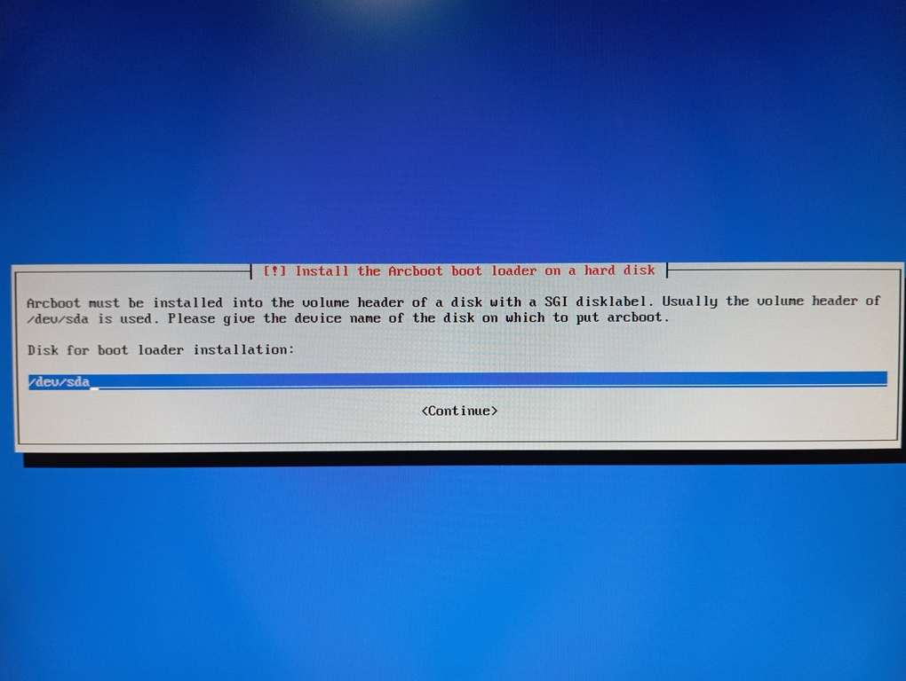
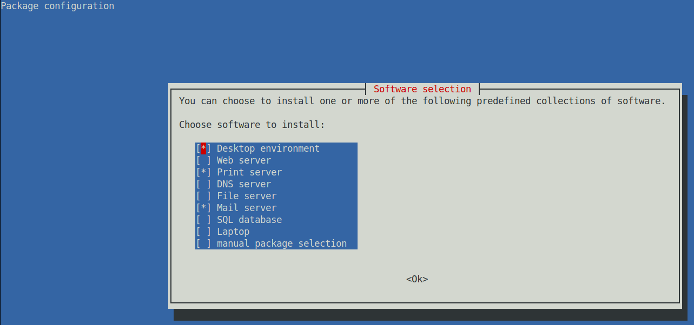

# Installing Debian GNU/Linux on SGI Indy
<br>
<br>
According to my experience, installing Debian GNU/Linux on Indy using netinstall CD or net boot has these issues:<br>
9, 10, ... : for specific motherboards, incompatible with Indy<br>
8: strange chars are shown on boot and freezes https://www.youtube.com/watch?v=pADq72n-V_0<br>
7, 6, 5: error copying kernel to disk: "WARNING: the following packages cannot be authenticated". The package is kernel_version-r4k-ip22<br>
4: installation Ok<br>
<br>
<h3>1. Download the file netboot-boot.img and store it on Reanimator's directory /home/irix/i</h3>
- download link: http://archive.debian.org/debian/dists/etch/main/installer-mips/current/images/r4k-ip22/netboot-boot.img<br>
<br>
<h3>2. Run on Command Monitor:</h3>

```
setenv netaddr 192.168.9.1
bootp():netboot-boot.img
```
** tip **<br>
- define a "debian" variable in Command Monitor:<br>
Indy: <b>setenv -p debian "bootp():netboot-boot.img"</b><br>
This way, you can run $debian in Command Monitor to easily start the Debian installation:<br>

```
setenv netaddr 192.168.9.1
$debian
```
(video) <a href=https://youtu.be/g21rlFwnXjY target="_blank">Indy booting Debian GNU/Linux 4.0 Etch installation</a><br>
<br>
<h3>3. Partitioning the hard disk</h3>
- My disk:

```
Disk /dev/sda (SGI disk label): 64 heads, 32 sectors, 8678 cylinders
Units = cylinders of 2048 * 512 bytes
```

```
user@indy:~$ sudo hwinfo --disk
01: SCSI 01.0: 10600 Disk                                       
  [Created at block.218]
  Unique ID: 0549.4HNtyCTGo35
  SysFS ID: /block/sda
  SysFS BusID: 0:0:1:0
  SysFS Device Link: /devices/platform/host0/target0:0:1/0:0:1:0
  Hardware Class: disk
  Model: "HP 9.10GB A 68-S94C"
  Vendor: "HP"
  Device: "9.10GB A 68-S94C"
  Revision: "S94C"
  Serial ID: "RE244084"
  Driver: "sd"
  Device File: /dev/sda (/dev/sg0)
  Device Files: /dev/sda, /dev/disk/by-id/scsi-SHP_9.10GB_A_68-S94RE244084
  Device Number: block 8:0-8:15 (char 21:0)
  Geometry (Logical): CHS 8678/64/32
  Size: 17773524 sectors a 512 bytes
  Config Status: cfg=new, avail=yes, need=no, active=unknown
``` 
- reference: https://www.pvv.org/~pladsen/Indy/HOWTO.html<br>
- in my case:

```
dd if=/dev/zero of=/dev/sda count=1 bs=512
```
```
Use fdisk /dev/sda

Enter expert mode: x
Make disklabel: g
Leave expert mode: r
```
Cylinder size: cs=2048*512=1048576 bytes=1 MB<br>
The last cylinder: lc=8677<br>
<br>
Start of 	volume header = 0<br>
End of	volume header:	ev	= 50 / cs = 50<br>
Start of	Linux swap:	ss 	= lc - 128/cs = 8677-128/1 = 8549<br>
End of	Linux swap:	es	= lc = 8677<br>
Start of	Linux native:	sn	= ev + 1 = 51<br>
End of	Linux native:	en	= ss - 1 = 8548<br>

Make the Linux partition: d - 1 - n - 1 - sn - en<br>
Make the volume header: d - 9 - n - 9 - 0 - ev<br>
Make the swap partition: d - 2 - n - 2 - ss - es - t - 2 - 82<br>
--><br>
Make the Linux partition: d - 1 - n - 1 - 51 - 8548<br>
Make the volume header: d - 9 - n - 9 - 0 - 50<br>
Make the swap partition: d - 2 - n - 2 - 8549 - 8677 - t - 2 - 82<br>
Write the table to disk: w<br>
<br>
<h3>4. Selecting a mirror</h3>
- when asked, type a custom hostname for the mirror: archive.debian.org and accept "/debian/" as directory:<br>
<br>
<br>
An Indy is a pretty slow machine, the installation process wil take <b>at least</b> 6 hours, please be patient.
<br>
<h3>5. Making it boot</h3>
- reference: Debian installation<br>
<br>
<br>

```
setenv OSLoader arcboot
setenv OSLoadFilename Linux
setenv SystemPartition dksc(0,1,8)
setenv OSLoadPartition dksc(0,1,0)
```
<h3>6. Tips</h3>
- an Indy is a pretty slow machine, the installation process will take <b>at least</b> 6 hours, please be patient.<br>
- I tried to install both "Base system" and "Desktop environment" first, but the installation got stuck. So I installed just "Base system" and after rebooting I installed "Desktop environment" using tasksel:

```
indy:~# tasksel
```
<br>
- install some utilities after rebooting:<br>

```
indy:~# aptitude install openssh-server screen sudo hwinfo
```
- use "visudo" command as root to modify /etc/sudoers:

```
# /etc/sudoers
#
# This file MUST be edited with the 'visudo' command as root.
#
# See the man page for details on how to write a sudoers file.
#

Defaults        env_reset

# Host alias specification

# User alias specification

# Cmnd alias specification

# User privilege specification
root    ALL=(ALL) ALL
user    ALL=(ALL) ALL
```
- to avoid this error:

```
~$ ssh user@IP
Unable to negotiate with IP port 22: no matching key exchange method found. Their offer: diffie-hellman-group-exchange-sha1,diffie-hellman-group14-sha1,diffie-hellman-group1-sha1
```
- use this command:

```
~$ ssh -oKexAlgorithms=+diffie-hellman-group1-sha1 user@IP
```
