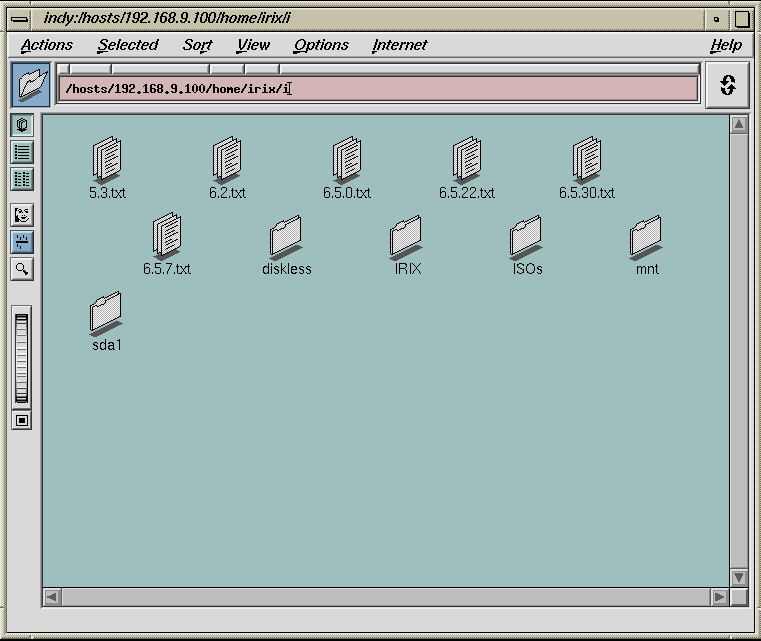
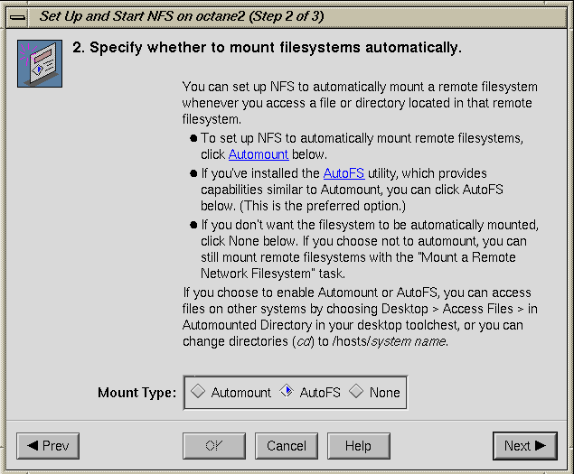

# Accessing files
 
 
Mount \\\\192.168.9.100\i or \\\\192.168.9.101\i, according to the installation platform. Some examples are provided using different network services: 

<h3>1. Using Samba</h3>
Windows: Windows key+R and type \\192.168.9.100\i 
GNU/Linux: connect to smb://192.168.9.100/i using your file manager 
GNU/Linux shell: sudo mount -t cifs //192.168.9.100/i /mnt 

<h3>2. Using NFS</h3>
RBPi:           sudo mount 192.168.9.100:/home/irix/i /mnt 
VirtualBox:     sudo mount 192.168.9.101:/home/irix/i /mnt 

<h3>3. Using IRIX (Yes!)</h3>
Open a file manager and type /hosts/192.168.9.100. This is how it looks: 
 

To make this work, be sure to set up NFS using AutoFS: Toolchest-->System-->SystemManager-->Networking and Conectivity-->Set Up and Start NFS: 

